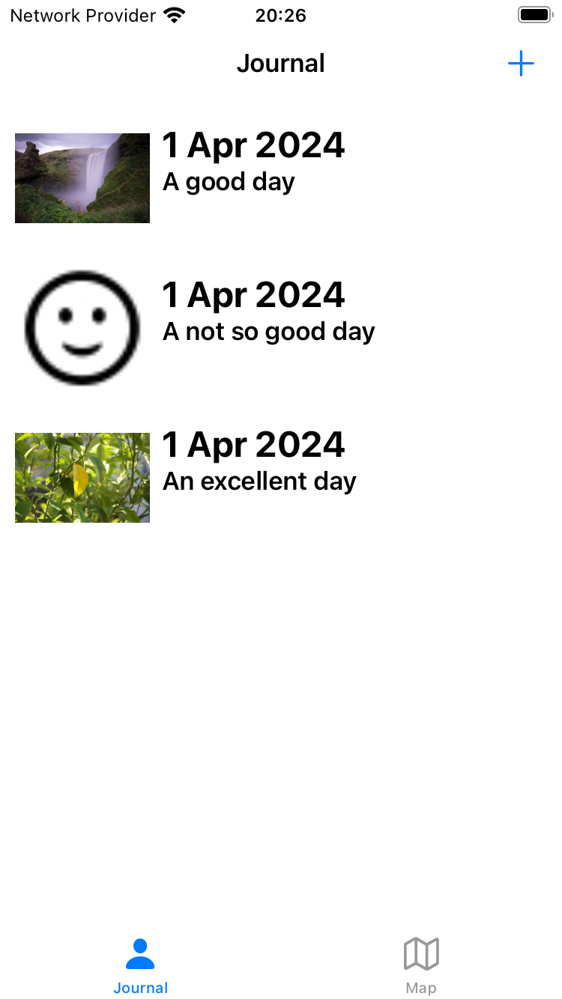
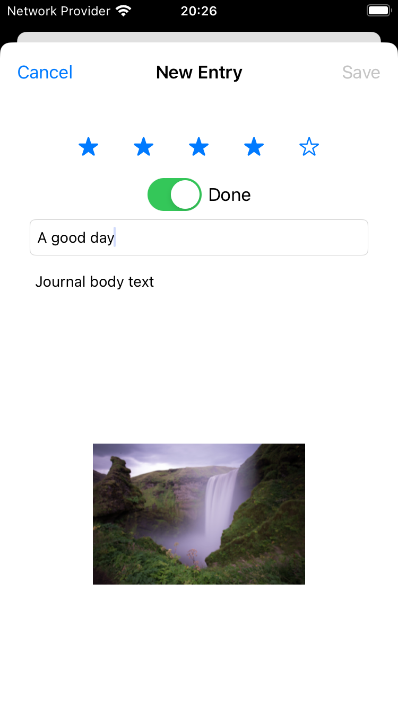
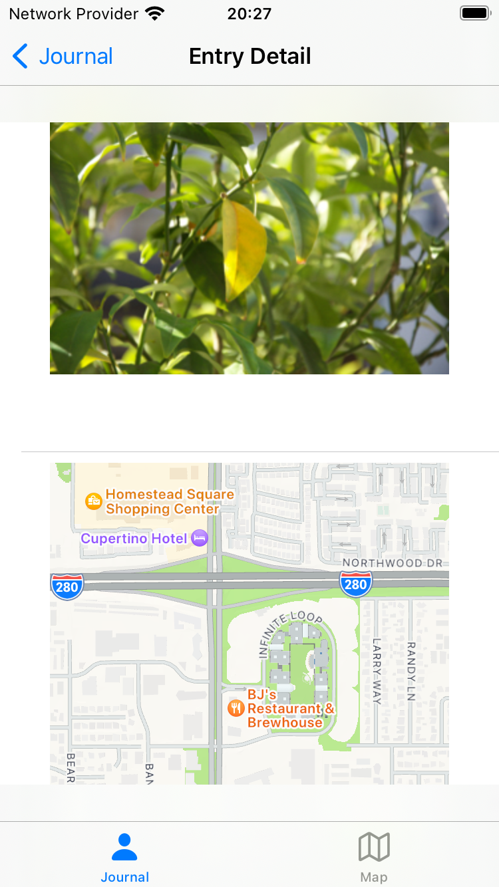
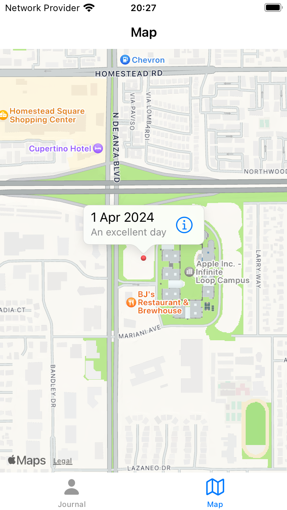
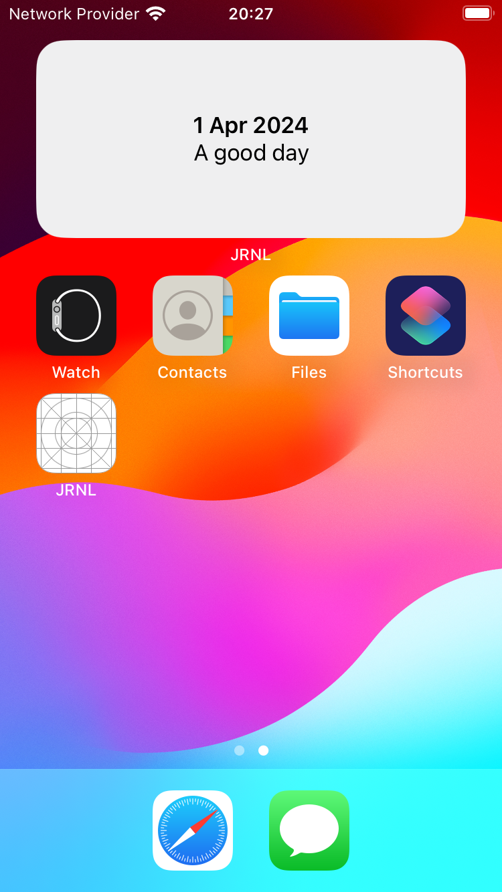
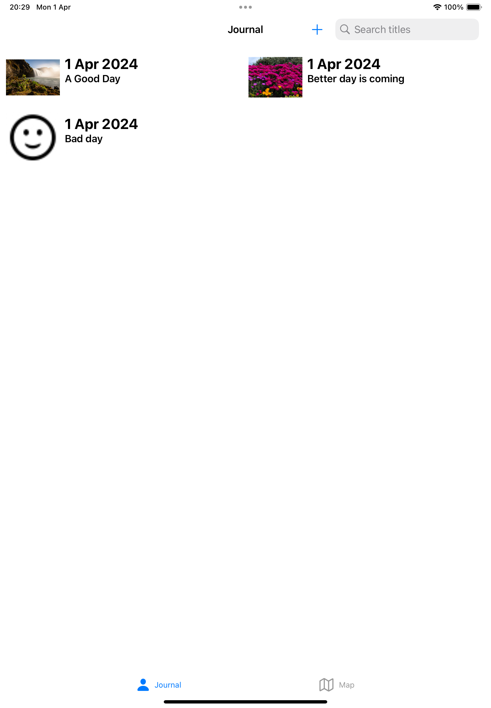
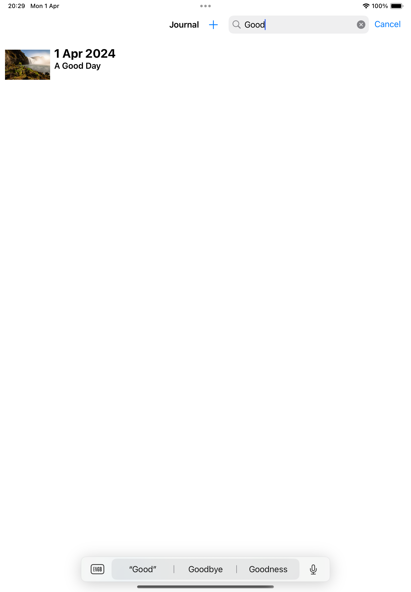
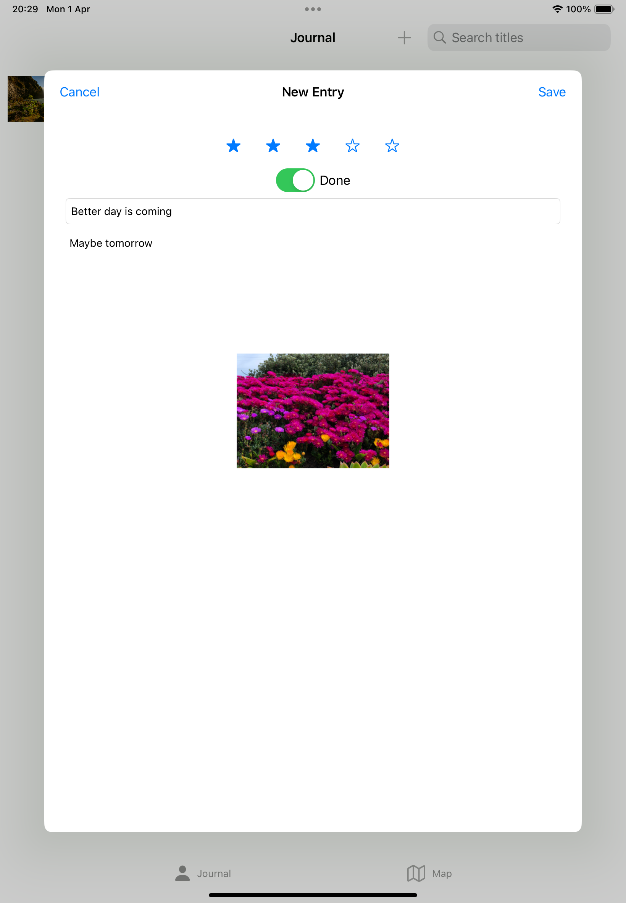
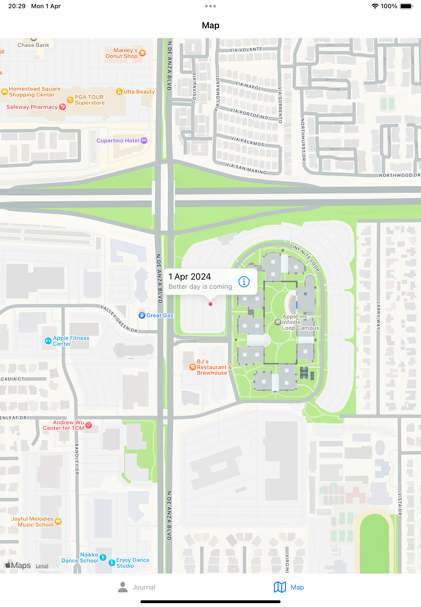

# JRNL - The Journaling App

&nbsp;

This is a demo app I built when going through the book [iOS 17 Programming for Beginners](https://www.packtpub.com/product/ios-17-programming-for-beginners-eighth-edition/9781837630561). I have combined the code so that it supports iPhone and iPad with widgets, and Apple Vision Pro with 3D models.
&nbsp;

This is the first complete iOS App I have ever built, therefore this codebase will serve as a playground for me to futher reshape it into something different.
&nbsp;

  
  
  

  
  

&nbsp;

This app allows submitting journal entries with title, body text, 5-star rating, picture and location. It provides a dynamic list view that supports search and delete, and can adjust the number of column on large screens. The saved journal entires can be dispayed as a lock screen or home screen widget. There is also a Map View screen presenting the journal entries as pins on the map, according to the location attached to the entires. When launching the App on Apple Vision Pro, there is a 3D earth model showing in front of the UI.
&nbsp;

  
  

  
  

  
  

  
  

&nbsp;

\## Key technical facts
The following skills and techniques were applied when building this app:
- Storyboard navigation and UI layout
- Swift and MVC architecture
- Core Location for obtaining device location
- Map view and POI handling
- Data persistence using JSON
- Custom View
- Camera, photo picker and image file handling
- Search
- Collection View for handling different screen sizes
- Lock screen and home screen widgets using SwiftUI
- VisionOS support, with 3D objects for the VisionOS app variant
- Code linting using [SwiftFormat](https://github.com/nicklockwood/SwiftFormat)

## TODO
Obviously this app lacks proper automated linting, CI/CD, and tests. The UI can be polished further, too. There are things in this App I have coded without understanding how it works, and it can be a lot of things to follow up. It all depends on my availability and priority to further work on this repository, but definitely there is a plan.
